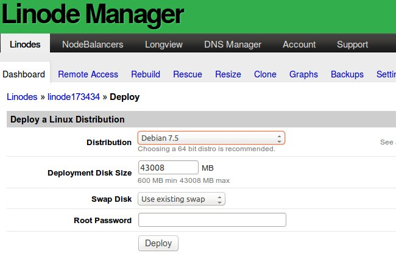

WebApp server setup with Nginx and Mojolicious
=============================================

# Introduction

This document explains how to create and setup a Web App implementing a Markdown presenter at Linode using Debian, Nginx, daemontools and Mojolicious.

Please change all references to **localhost** to the domain your server has.

## Final result 

The original of this document can be found at: 
[http://www.kobkob.org/tutorials/nginx-mojo.md](http://www.kobkob.org/tutorials/nginx-mojo.md)

I use the Vim editor. If you prefer another editor, like emacs or nano, use it. For me Vim is the best because it's light, smart and works very well. At the end of this document you can find the link to a good tutorial about Vim. Enjoy!

**Thanks everybody helping us.**

# Deploying a Debian Server on **Linode**

Before you begin see the **Getting Start**, at the end of this document.

After creating your new **Linode**, or if you already have one, select it and then click on **Deploy a Linux Distribution**. You'll be prompted to deploy a Linux distribution, as shown below. This is the operating system that will be installed on your Linode. You can choose from Arch Linux, CentOS, Debian, Fedora, Gentoo, openSUSE, Slackware, and Ubuntu. My choice is **Debian**.

## How to deploy a **Debian** distribution:

1. Select a Linux distribution from the Distribution menu. You should choose the distribution that you are most comfortable with. Consider selecting Debian 7.5. Debian is a realy free distribution, it's my default choice.
2. Enter a size for the disk image in the **Deployment Disk Size** field. By default, all of the available space is allocated, but you can set a lower size if you plan on cloning a disk image or creating different configuration profiles. You can always create, resize, and delete disk images later.
3. Select a size for the swap disk from the Swap Disk menu. We strongly recommend using the default size.
4. Enter a root password for your **Linode** in the **Root Password** field. The password must be at least 6 characters long and contain characters from two of the following categories: lower case letters, upper case letters, numbers, and punctuation. Don't forget this credential! You'll need it to log in to your **Linode** via SSH.
5. Click Rebuild.

## login and install packages

Now you have your **Debian** on the cloud. Use your prefered ssh client and login there! The fun part is begining.

Always I create a normal user for my logins because isn't good login with root account. You could do it later, now lets install the packages we must use in this job.

1. Login with your credentials and install some software we need with **apt-get**:

		apt-get install links2 nginx mojolicious libtext-markdown-perl daemontools daemontools-run

If you want to use **php** with nginx you must install it:

		sudo apt-get install php5-cli php5-fpm

2. Create the default service as D.J.Bernstein liked.

		ln -s /etc/service /service

I don't reccomend but if you prefer it's possible to install daemontools compiling it by hand. See at the end of this document.

# Creating the webApp

## Mojolicious

Lets enjoy our new web app. It's time.

1. Create the script with your prefered editor:

	    vi mdreader.pl

2. Write the perl script

	    #!/usr/bin/env perl
	    # mdreader.pl
		# This script reads md files, rendering html 
		
		use Mojolicious::Lite;
		use Text::Markdown qw{ markdown };
		use Path::Class;
		use Encode qw{ decode_utf8 };
		
		app->config(hypnotoad => {listen => ['http://*:8080']});
		
		plugin('Directory', root => "/opt/www", handler => sub {
		  my ($c, $path) = @_;
		  if ($path =~ /\.(md|mkdn)$/) {
			  my $text = file($path)->slurp;
			  my $html = markdown( decode_utf8($text) );
			  $c->render( inline => $html );
		  }
		})->start;
		 
		app->start;

Creating the directories where we can put the markdown files to be read by web:

		mkdir /opt/www
		
Copying the file of this document to be presented at web. Please, put there the document you want!

		cp weapp-server.md /opt/www/
		

## Testing, developing, production

You can do your custom modifications on the app just editing the script. Do it! Try how can be fun develop with Mojolicious. See the links at end of this document.

To see the app in action use the **morbo** development server:

	    morbo mdreader.pl

You will see the app in action pointing your web browser to http://localhost:8080/weapp-server.md

# Seting up nginx

1. With nginx you will publish your app at web with reverse proxy. Add this configuration at available sites for Nginx:

	    vi /etc/nginx/sites-available/mdreader

2. Write the comands above:

	
	 	upstream mdreader {
		  server 127.0.0.1:8080;
		}
		server {
		  listen 80;
		  server_name localhost;
		  location / {
		    proxy_pass http://mdreader;
		    proxy_http_version 1.1;
		    proxy_set_header Upgrade $http_upgrade;
		    proxy_set_header Connection "upgrade";
		    proxy_set_header Host $host;
		    proxy_set_header X-Forwarded-For $proxy_add_x_forwarded_for;
		    proxy_set_header X-Forwarded-Proto "http";
		  }
		}

If you want to serve php script use this setup too:

 location ~ \.php$ {
                fastcgi_split_path_info ^(.+\.php)(/.+)$;
                fastcgi_pass unix:/var/run/php5-fpm.sock;
                fastcgi_index index.php;
                include fastcgi_params;
        }

3. Create a simlink to enable and restart your Nginx:

	    ln -s /etc/nginx/sites-available/mdreader /etc/nginx/sites-enabled/0001-mdreader 
	    /etc/init.d/nginx restart

# Installing the daemons

Now we must automate the Web App startup when we boot the server and guarantize it will be running under control and logging messages uninterruptly. The choice is put it under daemontools service control. Lets do:

1. Create the service at daemontools:

		mkdir /service/.mdreader
		touch /service/.mdreader/run
		
2. Write a startup script 

		vi /service/.mdreader/run
		
4. Enable the service and reboot the system
        mv /service/.mdreader /service/mdreader
        reboot

# Colophon

* The animal sleeps now. It's cool!

A dragon is a legendary creature, typically with serpentine or reptilian traits, that features in the myths of many cultures.

# See also:

I strongly recomend you read the **Getting Start** tutorial for **Linode**: 
[https://www.linode.com/docs/getting-started](https://www.linode.com/docs/getting-started)

# daemontools by hand

## Install daemontools
    
1. Create a /daemontools directory:

		mkdir daemontools
		cd daemontools

2. Download daemontools-0.76.tar.gz into the directory daemontools. Unpack the daemontools package:

	     wget http://cr.yp.to/daemontools/daemontools-0.76.tar.gz
	     tar -xzf daemontools-0.76.tar.gz
	     rm daemontools-0.76.tar.gz
	     cd admin/daemontools-0.76

3. Compile and set up the daemontools programs:

	     package/install

4. Reboot your system to start svscan.

     
	     reboot

5. Report your succesful install to cr.yp.to (optional):

	     mail djb-sysdeps@cr.yp.to < /package/admin/daemontools/compile/sysdeps

# Credits

Wrote by Monsenhor filipo@kobkob.org at September 19, 2014. Orlando, FL, USA.
